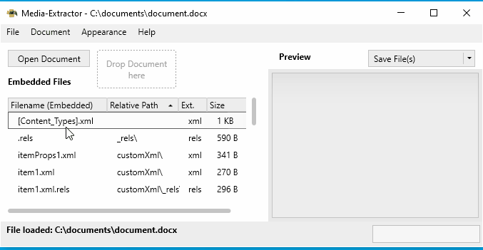

#  Media-Extractor

Media-Extractor is an application to preview and extract packed media in Microsoft Office files (e.g. Word, PowerPoint or Excel documents), as well as in common archive files (e.g. zip, 7z, tar). Media-Extractor was written in C# and uses the 7zip library as archive processor, as well as WPF as GUI framework.

## Download

The most recent version of Media-Extractor can be downloaded on the [Page of the latest Release](https://github.com/rabanti-github/Media-Extractor/releases/latest).
Usually, the **Release version** is suitable for the most users (e.g. '**Media-Extractor_Release_v1.7.0.zip**').
The debug version (Debug.zip), as well as the source code (zip / tar.gz), is only necessary for development purpose.

Please see also the section [SmartScreen Warning in Windows 8.1 and 10](#smartscreen-warning-in-windows-81-and-10)

## Feature Overview

* Supports most of the new Office formats (e.g. docx, xlsx, pptx)
* Supports a variety of archive formats (e.g. zip, tar, 7z)
* Creates previews of the most commonly used image formats used in Office (e.g. png, jpg, emf) which can be embedded
* Creates previews of embedded text and XML files
* Option to preview unknown, embedded files as plain text
* Supports export of all embedded files at once, selected ones or particular ones
* Supports export of other embedded data (e.g. xml files in xlsx or docx)
* Loading of files by menu, button, drag&drop or 'open with' (Windows Explorer)
* Dark mode
* Translations (see section [Translations](#Translations))

---

### Loading Documents

Documents (e.g. Excel worksheets, Word documents or zip archives) can be opened either by menu, using the open button in the application, drag and drop of the document into a drop area, drag and drop the document into the application or using the Windows Explorer context menu "Open with..."

### Appearance

Media-Extractor supports on the fly changing of the language (see section [Translations](#Translations)) and switching between light and dark mode.

### Preview of embedded Files

By default, only previews of images are provided when loading a document in Media-Extractor. However, all other files (e.g. XML, texts, config files or binary blobs) can be enabled for previews. There is also an option to display unknown file formats as texts. Nevertheless, the attempt to display binary files (e.g. exe, nested archives or movie clips) as text may still fail.
Furthermore, embedded files can be sorted based on its properties, like file name, size or extension.

### Saving of embedded Files

Embedded files can be saved in various ways. If no file is selected in the list, all files are saved by default. One or many files (using ctrl or shift key) can be selected in the list and extracted. The default of saving all or saving only selected files can be defined with the save button on the right side of the application.
Saving of embedded files is independent of the previews. They can be saved, even if not possible to be displayed as preview.

---

## System Requirements
Media-Extractor does not need an installation. The [downloaded zip file](#Download) can be unzipped in a folder of your choice. The system requirements are:

* Microsoft Windows 7, 8.x, 10
* .NET 4.5 or higher installed

Please see the section about the [SmartScreen Warning](#smartscreen-warning-in-windows-81-and-10) if you have problem to run the application after downloading.

## Translations

Currently, Media-Extractor is translated to the following Languages:

| Language | Status    | Provided by        |
| -------- | --------- | ------------------ |
| **English**  | Completed | Application Author |
| **German**   | Completed | Application Author |

If you are interested in translating the application, please [open a new Issue](https://github.com/rabanti-github/Media-Extractor/issues/new) with the tag '**translation**'. The defined terms that are to be translated can be found in [this wiki Article](https://github.com/rabanti-github/Media-Extractor/wiki/Translation-Template). Alternatively, the default translation terms can be downloaded as [Excel file](./resources/translation/DefaultTranslationStrings.xlsx). This is a direct copy of the default [Resources.resx file](https://github.com/rabanti-github/Media-Extractor/blob/master/MediaExtractor/Properties/Resources.resx).
Please don't hesitate to ask, if the context of a term is not clear.

## SmartScreen Warning in Windows 8.1 and 10

Windows 8.1 introduced a mechanism to protect users from phishing websites and malware, yet not known to Antivirus programs. This mechanism is called [SmartScreen](https://support.microsoft.com/en-us/help/17443/microsoft-edge-smartscreen-faq) and either blocks the access to a malicious website, or the execution of unknown apps.
Unfortunately, it is possible that Media-Extractor is initially blocked by SmartScreen, since the mechanism don't know the app until 'some people' have downloaded and executed the app. The number of necessary downloads until the app is not seen as unknown (thus, not blocked by SmartScreen anymore) is not that clear.
The second unfortunately fact is that SmartScreen will be triggered by each new version of the app.
What you can do to execute Media-Extractor:

* Tell SmartScreen that you trust the app (must only declared once)
* Disable SmartScreen according to [this article](https://support.microsoft.com/en-us/help/17443/microsoft-edge-smartscreen-faq)
* Wait until enough people have downloaded and executed Media-Extractor

Note: Similar mechanisms may be also triggered by Browsers, like Edge, Chrome or Vivaldi

## Development Dependencies

The following libraries / dependencies are necessary for the development of Media-Extractor. All of them are maintained by NuGet:

* SevenZipExtractor
* WindowsAPICodePack-Core and WindowsAPICodePack-Shell
* AdonisUI and AdonisUI.ClassicTheme
* NanoXLSX (for TranslationHelper project)
* Mono.Options (for TranslationHelper project)

## License

Media-Extractor is developed and distributed freely and without any costs, under the [MIT license](https://opensource.org/licenses/MIT).

